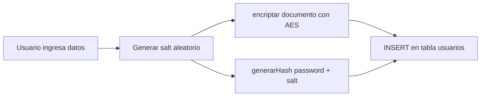

# 🔐 Encriptación, HASH y SALT en MySQL/MariaDB

## 📑 Tabla de contenido

- [1. Introducción](#1-introducción)
- [2. Encriptación simétrica (AES)](#2-encriptación-simétrica-aes)
  - [2.1 Conceptos básicos](#21-conceptos-básicos)
  - [2.2 Función de encriptación](#22-función-de-encriptación)
  - [2.3 Función de desencriptación](#23-función-de-desencriptación)
- [3. Compresión de texto (COMPRESS / UNCOMPRESS)](#3-compresión-de-texto-compress--uncompress)
- [4. Funciones HASH (SHA2)](#4-funciones-hash-sha2)
- [5. El problema del HASH puro y la solución: SALT](#5-el-problema-del-hash-puro-y-la-solución-salt)
- [6. Función generarHash](#6-función-generarhash)
- [7. Procedimiento de registro completo](#7-procedimiento-de-registro-completo)
- [8. Tabla comparativa: Encriptar vs Hashear](#8-tabla-comparativa-encriptar-vs-hashear)
- [9. Errores comunes](#9-errores-comunes)
- [10. Buenas prácticas](#10-buenas-prácticas)

---

## 1. Introducción

En la clase de hoy trabajamos dos formas distintas de proteger información sensible dentro de una base de datos:

1. **Encriptación (cifrado reversible)**: se usa cuando necesitamos **recuperar el dato original** más adelante (ej. un número de documento). Requiere una **clave** para cifrar y la misma clave para descifrar.
2. **Hashing (cifrado irreversible)**: se usa para datos que **nunca necesitamos volver a leer en texto plano**, como las contraseñas. Un HASH no se puede "deshacer"; solo se puede volver a generar y comparar.

> [!NOTE]
> La diferencia clave: si alguien roba la base de datos, un dato **encriptado** puede recuperarse si consigue la clave; un dato **hasheado** correctamente (con SALT) es prácticamente imposible de revertir.

---

## 2. Encriptación simétrica (AES)

### 2.1 Conceptos básicos

MariaDB permite encriptar datos usando el algoritmo **AES** (Advanced Encryption Standard) a través de las funciones nativas `AES_ENCRYPT()` y `AES_DECRYPT()`. Es un cifrado **simétrico**: la misma clave sirve para cifrar y para descifrar.

```sql
-- Generar una clave derivada con SHA2 (opcional, buena práctica)
SET @clave = SHA2("palabra", 512);

-- Encriptar un texto usando la clave
SET @texto = AES_ENCRYPT("Hoy es viernes", @clave);
SELECT HEX(@texto) AS cifrado;

-- Desencriptar usando la MISMA clave
SELECT CAST(AES_DECRYPT(@texto, @clave) AS CHAR) AS textoDescifrado;
```

**Resultado:**

| textoDescifrado |
|---|
| Hoy es viernes |

> [!IMPORTANT]
> Si la clave usada en `AES_DECRYPT()` no es exactamente la misma que se usó en `AES_ENCRYPT()`, la función no lanza error: simplemente devuelve `NULL` o datos corruptos. Esto fue justo lo que pasó en clase cuando `desencriptar()` usaba la clave `'SENA'` pero un intento anterior probó con `'Desencriptar'` y `'Branditon'`.

### 2.2 Función de encriptación

```sql
DELIMITER $$

CREATE DEFINER=`root`@`localhost` FUNCTION `encriptar`(texto VARCHAR(60))
RETURNS VARBINARY(200)
DETERMINISTIC
BEGIN
    DECLARE datoC VARBINARY(200);
    SET datoC = AES_ENCRYPT(texto, 'SENA');
    RETURN datoC;
END $$

DELIMITER ;
```

- **Parámetro de entrada:** `texto` — el dato en claro que se quiere proteger.
- **Retorno:** `VARBINARY(200)` — el dato cifrado en binario (por eso al consultarlo se ve como caracteres extraños; para verlo legible se usa `HEX()`).
- **Clave fija:** `'SENA'` — en un proyecto real esta clave debería salir de una variable de entorno o un gestor de secretos, nunca escrita directamente en el código SQL.

```sql
SELECT HEX(encriptar('Zaida')) AS cifrado;
```

### 2.3 Función de desencriptación

```sql
DELIMITER $$

CREATE DEFINER=`root`@`localhost` FUNCTION `desencriptar`(dato VARBINARY(200))
RETURNS VARCHAR(100)
    CHARSET utf8mb4 COLLATE utf8mb4_general_ci
DETERMINISTIC
BEGIN
    DECLARE TxtO VARCHAR(100);
    SET TxtO = CAST(AES_DECRYPT(dato, 'SENA') AS CHAR(100));
    RETURN TxtO;
END $$

DELIMITER ;
```

```sql
SELECT idUsuario, nombre, desencriptar(documento), correo
FROM usuarios;
```

> [!TIP]
> `AES_DECRYPT()` devuelve un tipo binario; por eso siempre se envuelve en `CAST(... AS CHAR(n))` para poder leerlo como texto normal.

---

## 3. Compresión de texto (COMPRESS / UNCOMPRESS)

MariaDB también permite comprimir cadenas largas para ahorrar espacio de almacenamiento, usando el algoritmo **zlib**.

```sql
-- Comprimir
SET @vari = "A las 7 viene un aprendiz";
SET @comprimido = COMPRESS(@vari);
SELECT HEX(@comprimido) AS cifrado;

-- Descomprimir
SELECT CAST(UNCOMPRESS(@comprimido) AS CHAR(10000)) AS textoDescomprimido;
```

**Resultado:**

| textoDescomprimido |
|---|
| A las 7 viene un aprendiz |

> [!NOTE]
> `UNCOMPRESS()` necesita el `CAST` a un `CHAR` con longitud suficiente (por ejemplo `CHAR(10000)`), porque el resultado nativo es binario y puede truncarse si el tamaño declarado es muy pequeño.

La función `UNCOMPRESS_LENGTH()` **no existe en MariaDB** (sí existe en MySQL puro). Es un buen ejemplo de que no todo lo documentado para MySQL está disponible 1:1 en MariaDB.

---

## 4. Funciones HASH (SHA2)

`SHA2()` genera un **resumen (digest) de longitud fija** a partir de cualquier texto. A diferencia de AES, **no existe una función inversa**: no hay "SHA2_DECRYPT". Solo sirve para comparar, nunca para recuperar el original.

```sql
SELECT SHA2("clave123", 256) AS Usuario1;
SELECT SHA2("clave123", 256) AS Usuario2;
```

Ambas consultas devuelven **exactamente el mismo hash**:

```
5ac0852e770506dcd80f1a36d20ba7878bf82244b836d9324593bd14bc56dcb5
```

> [!IMPORTANT]
> Este es el problema central que vimos en clase: si dos usuarios distintos usan la misma contraseña (`clave123`), el HASH que se guarda en la base de datos será **idéntico** para ambos. Esto es un riesgo de seguridad, porque un atacante que descubra el hash de un usuario automáticamente conoce la contraseña de todos los usuarios que compartan esa misma contraseña (y puede usar tablas precalculadas conocidas como *rainbow tables*).

---

## 5. El problema del HASH puro y la solución: SALT

El **SALT** es un valor aleatorio único que se genera **por usuario** y se concatena con la contraseña **antes** de aplicar el HASH. Así, aunque dos usuarios tengan la misma contraseña, el resultado final será distinto porque el SALT de cada uno es diferente.

```sql
-- Generar un salt aleatorio (MariaDB no trae RANDOM_BYTES en esta versión, se usa MD5(RAND()) como alternativa)
SET @salt  = MD5(RAND());
SET @salt2 = MD5(RAND());

SELECT @salt, @salt2;
```

```sql
-- Mismo password, distinto salt -> distinto hash final
SELECT SHA2(CONCAT("clave123", @salt), 256)  AS usuario1;
SELECT SHA2(CONCAT("clave123", @salt2), 256) AS usuario2;
```

Aunque ambos usuarios escribieron `clave123`, los hashes resultantes son completamente diferentes porque cada `@salt` es único.

Para poder validar el login más adelante, el SALT **debe guardarse también en la base de datos** (no es secreto, solo necesita ser único):

```sql
ALTER TABLE usuarios
    ADD COLUMN salt VARCHAR(32),
    ADD COLUMN passwordH CHAR(64);
```

| Campo | Tipo | Propósito |
|---|---|---|
| `salt` | `VARCHAR(32)` | Valor aleatorio único por usuario (no es secreto) |
| `passwordH` | `CHAR(64)` | Resultado de `SHA2(password + salt, 256)`, longitud fija de 64 caracteres hexadecimales |

> [!NOTE]
> `RANDOM_BYTES()` no está disponible en esta versión de MariaDB (10.4), por eso en clase se usó `MD5(RAND())` como generador de salt. `RAND()` no es criptográficamente seguro, así que en un entorno de producción real se recomienda generar el salt desde el lenguaje de backend (PHP, Node, etc.) con una librería criptográfica.

---

## 6. Función generarHash

```sql
DELIMITER $$

CREATE DEFINER=`root`@`localhost` FUNCTION `generarHash`(
    passwordT VARCHAR(100),
    saltT VARCHAR(100)
) RETURNS CHAR(64)
    CHARSET utf8mb4 COLLATE utf8mb4_general_ci
DETERMINISTIC
BEGIN
    DECLARE hashG CHAR(64);
    SET hashG = SHA2(CONCAT(passwordT, saltT), 256);
    RETURN hashG;
END $$

DELIMITER ;
```

Esta función encapsula el patrón `password + salt → SHA2` para no repetir la lógica cada vez que se registra un usuario.

---

## 7. Procedimiento de registro completo

```sql
DELIMITER $$

CREATE DEFINER=`root`@`localhost` PROCEDURE `registro`(
    IN nom  VARCHAR(20),
    IN doc  VARCHAR(30),
    IN corr VARCHAR(29),
    IN pass VARCHAR(100)
)
BEGIN
    DECLARE nuevoSalt VARCHAR(30);
    SET nuevoSalt = MD5(RAND());

    INSERT INTO usuarios (nombre, documento, correo, salt, passwordH)
    VALUES (
        nom,
        encriptar(doc),
        corr,
        nuevoSalt,
        generarHash(pass, nuevoSalt)
    );
END $$

DELIMITER ;
```

> [!IMPORTANT]
> En el apunte original, `generarHash()` recibía `passwordH` (la columna de la tabla, todavía vacía) en lugar del parámetro de entrada `pass` con la contraseña real escrita por el usuario. Se corrigió aquí agregando el parámetro `IN pass VARCHAR(100)` al procedimiento, que es el valor que realmente se debe hashear. Sin este parámetro, `generarHash()` siempre recibiría `NULL`.

**Flujo completo del registro:**



---

## 8. Tabla comparativa: Encriptar vs Hashear

| Aspecto | Encriptación (AES) | Hash (SHA2 + SALT) |
|---|---|---|
| ¿Es reversible? | Sí, con la clave correcta | No, nunca |
| ¿Para qué se usa? | Datos que se necesitan leer después (documento, tarjeta) | Contraseñas, datos que solo se comparan |
| ¿Requiere clave? | Sí, la misma para cifrar/descifrar | No, pero requiere un SALT único |
| Funciones MariaDB | `AES_ENCRYPT()` / `AES_DECRYPT()` | `SHA2()` |
| Riesgo si se filtra la clave | Alto (se puede descifrar todo) | No aplica (no hay clave que filtrar) |
| Riesgo sin SALT | No aplica | Alto (mismos passwords = mismo hash) |

---

## 9. Errores comunes

| Error | Causa | Solución |
|---|---|---|
| `ERROR 1064` al usar `DECLARE` fuera de un bloque `BEGIN...END` | Se escribió `DECLARE` como si fuera una sentencia SQL normal, sin estar dentro de una rutina | `DECLARE` solo es válido como primera instrucción dentro de un `BEGIN...END` de función/procedimiento |
| `ERROR 1305: FUNCTION ... does not exist` (`RANDOM_BYTES`, `UNCOMPRESS_LENGTH`) | Se usó una función que existe en MySQL pero no en esta versión de MariaDB | Verificar la documentación específica de MariaDB antes de usar una función; usar alternativas como `MD5(RAND())` |
| `ERROR 1582: Incorrect parameter count` en `AES_DECRYPT()` | Se llamó a la función con un solo argumento (faltaba la clave) | `AES_DECRYPT()` siempre requiere 2 argumentos: el dato y la clave |
| El resultado de `desencriptar()` sale `NULL` | La clave usada al desencriptar no coincide con la usada al encriptar | Usar siempre la misma clave literal (o la misma variable) en ambas funciones |
| `Empty set` al hacer `SELECT * FROM usuarios` después de insertar | Se corrió el `SELECT` sobre una sesión/base de datos distinta, o el `INSERT` falló silenciosamente antes | Confirmar con `SHOW TABLES` y revisar que el `USE basededatos;` esté activo |
| Olvidar el `DELIMITER $$` antes de crear una función con `;` internos | El cliente interpreta el primer `;` como fin de sentencia y corta la función a la mitad | Siempre cambiar el delimitador (`DELIMITER $$`) antes de definir rutinas, y devolverlo a `;` al terminar |

---

## 10. Buenas prácticas

> [!TIP]
> - Nunca guardar contraseñas en texto plano ni cifradas de forma reversible: siempre usar HASH + SALT.
> - El SALT no es secreto, pero **debe ser único por usuario** y almacenarse junto al hash.
> - Evitar claves de encriptación "quemadas" en el código SQL (`'SENA'`); en un entorno real deben vivir en variables de entorno o un gestor de secretos.
> - Usar `CHAR(64)` para guardar hashes SHA2-256, ya que su longitud es siempre fija.
> - Verificar en la documentación oficial si una función existe en **MariaDB** y no solo en MySQL, ya que no son 100% compatibles (ej. `RANDOM_BYTES`, `UNCOMPRESS_LENGTH`).
> - Probar las funciones por separado (`SELECT encriptar(...)`, `SELECT generarHash(...)`) antes de integrarlas dentro de un procedimiento completo, para aislar errores más fácilmente.

---

⬅️ [Volver al índice de SQL](./README.md)
